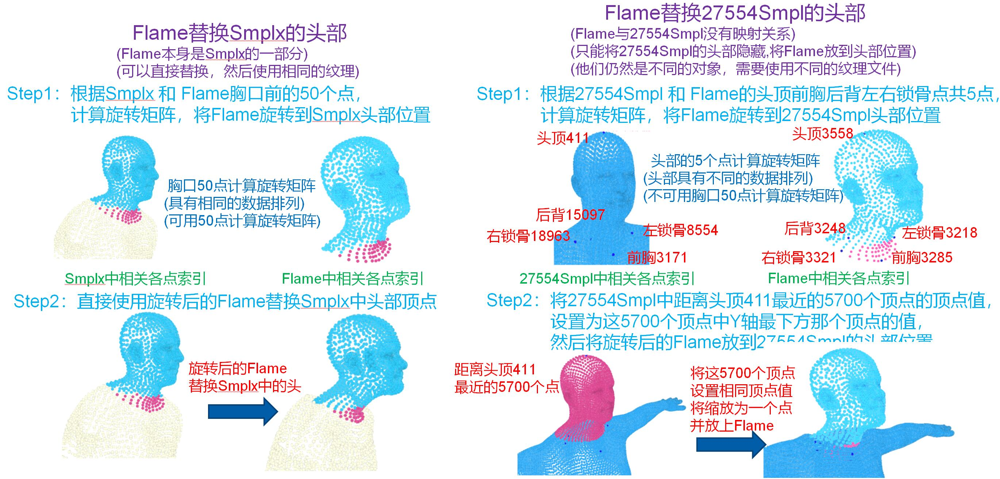

# VirtualDigitalHuman_WorkReport(正在完善中)
This is a work report repository about Virtual Digital Human, including 3D Human Head, 3D Human Bodies, 3D Human Motions, 3D Human Textures, and 3D Virtual Tryon.  
I have compiled the research results into the work report in PDF format, PDF can be found [here](VirtualDigitalHuman_WorkReport.pdf). 
All materials provided by this repository, including MP4, GIF, PDF, JPG, have also been put on [pan.baidu.com](https://pan.baidu.com/s/1DAcX4ngI5wYj3Ad_goTp4w?pwd=7y69) 

This repository mainly contains two demos, as well as their implementation details and pipelines

## Demo1 : 3D Virtual Tryon
Try on various clothes to different postures and shapes of body models, and replace their heads with Flames(with facial expression).  
Finally, the 3D virtual human with voice broadcast function is generated. 
The GIF of the final results and the implementation process are shown below :  
(MP4 with sound of the final results, please download the [3DVirtualTryon.mp4](3DVirtualTryon.mp4) and [3DVirtualTryonTurn.mp4](3DVirtualTryonTurn.mp4). They are also included in the [pan.baidu.com](https://pan.baidu.com/s/1DAcX4ngI5wYj3Ad_goTp4w?pwd=7y69) )
<table><tr>
<td></td>
<td></td>
</tr></table>

## Demo2 : 3D Human Reconstruction
Through the front and back pictures and action videos of the human body, Smplx body models and corresponding textures and actions are generated.
Replace the head with Flames(with facial expression) in a different way than above. 
Finally, Another 3D virtual human with voice broadcast function is generated. 
The GIF of the final results and the implementation process are shown below :  
(MP4 with sound of the final results, please download the [3DHumanReconstruction.mp4](3DHumanReconstruction.mp4). It is also included in the [pan.baidu.com](https://pan.baidu.com/s/1DAcX4ngI5wYj3Ad_goTp4w?pwd=7y69) )
<table><tr>
<td></td>
</tr></table>

## Detail1 : Voice generated flames facial expression
We generate voice through TTS based on text data and then generate flames facial expression (e.g., lips and wink) through VOCA.  
Both demos use the flames face expression (e.g., lips and wink).  
The text data we use is: "8日下午，习--总--在四川省宜宾市先后考察了三江口、宜宾学院、极米光电有限公司，了解长江流域生态修复保护、高校毕业生就业、企业自主创新等情况。". Sensitive words were replaced with ‘-’. 
The GIF of the final results is shown below :  
(MP4 with sound of the final results, please download the [VOCAOutput_XJPDY.mp4](VOCAOutput_XJPDY.mp4). It is also included in the [pan.baidu.com](https://pan.baidu.com/s/1DAcX4ngI5wYj3Ad_goTp4w?pwd=7y69) )
<table><tr>
<td></td>
</tr></table>

## Detail2 : Flames-based Head Replacement
Different replacement methods were used to replace the heads of 27554smpl and smplx with flames. 
27554Smpl is the body model of Demo1(3D Virtual Tryon), which contains 27554 vertices. Smplx is the body model of Demo2(3D Human Reconstruction). 
The two replacement methods are as follows :

## Reference
