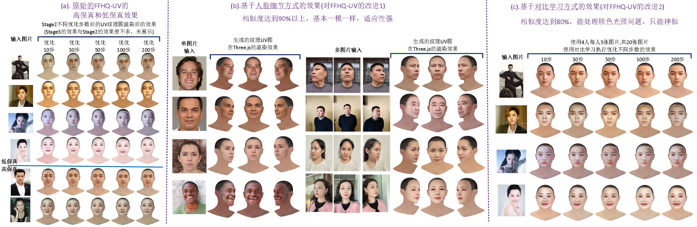
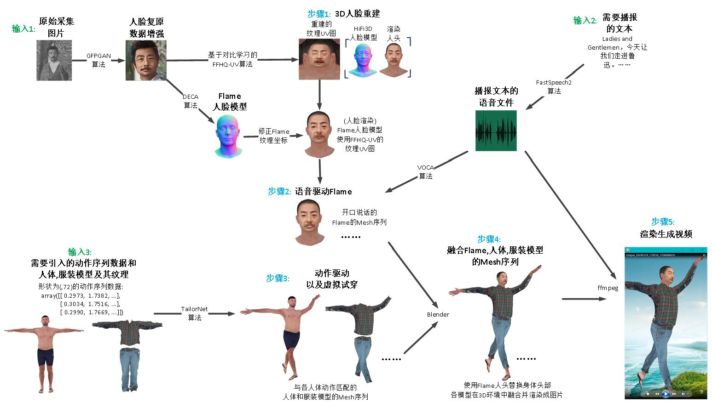

# VirtualDigitalHuman_WorkReport
This is a work report repository about Virtual Digital Human, including 3D Human Head, 3D Human Bodies, 3D Human Motions, 3D Human Textures, and 3D Virtual Tryon.  
I have compiled the research results into the work report in PDF format, PDF can be found [here](VirtualDigitalHuman_WorkReport.pdf). 

This repository mainly contains one demos, as well as their implementation details and pipelines

## Demo1 : Using facial detail methods and contrastive learning methods to improve FFHQ-UV
1. The following image :  
(a).FFHQ-UV method: The high fidelity and low fidelity human faces of the original FFHQ-UV algorithm   
(b).Face detail method: similarity is more than 90%, basically identical, and has strong adaptability  
(c).Comparative learning method: 80% similarity, able to handle skin tone and lighting issues, only able to have a similar appearance  

2. The following GiF-File :  
(a).Using Facial-Detail-Methods to reconstruct 某人's 3D face,            
(b).Using contrastive learning methods to reconstruct 鲁迅's 3D face，    
and all Add mouth shaped voice broadcasting and actions to generate 3D digital humans.  
<table><tr>
<td></td>
<td></td>
</tr></table>

## Detail1 : Pipeline of 3D Human Reconstruction

## Detail2 : Flame-based Head Replacement
Different replacement methods were used to replace the heads of 27554smpl and smplx with flames. 
27554Smpl is the body model of Demo1(3D Virtual Tryon), which contains 27554 vertices. Smplx is the body model of Demo2(3D Human Reconstruction). 
The two replacement methods are as follows :

## Reference
We have referred to many open source projects, and we have listed a few of them. 
[SMPL](https://smpl.is.tue.mpg.de/) 
[SMPLX](https://github.com/vchoutas/smplx) 
[textured_smplx](https://github.com/qzane/textured_smplx) 
[Mesh](https://github.com/MPI-IS/mesh) 
[Flame](https://flame.is.tue.mpg.de/index.html) 
[FLame2SMPLX](https://github.com/CvHadesSun/FLame2SMPLX) 

[FACIAL](https://github.com/zhangchenxu528/FACIAL) 
[FACEGOOD-Audio2Face](https://github.com/FACEGOOD/FACEGOOD-Audio2Face) 
[voca](https://github.com/TimoBolkart/voca) 
[meshtalk](https://github.com/facebookresearch/meshtalk) 
[FaceFormer](https://github.com/EvelynFan/FaceFormer) 

[Open3D](https://github.com/isl-org/Open3D) 
[hifi3dface](https://github.com/tencent-ailab/hifi3dface) 
[VideoPose3D](https://github.com/facebookresearch/VideoPose3D) 
[RingNet](https://github.com/soubhiksanyal/RingNet) 
[DECA](https://github.com/YadiraF/DECA) 
[PIXIE](https://github.com/YadiraF/PIXIE) 
[ICON](https://github.com/YuliangXiu/ICON) 

[neural-blend-shapes](https://github.com/PeizhuoLi/neural-blend-shapes) 
[deep-motion-editing](https://github.com/DeepMotionEditing/deep-motion-editing) 
[RigNet](https://github.com/zhan-xu/RigNet) 

[MultiGarmentNetwork](https://github.com/bharat-b7/MultiGarmentNetwork) 
[TailorNet](https://github.com/chaitanya100100/TailorNet) 
[pix2surf](https://github.com/aymenmir1/pix2surf) 
[vto-garment-collisions](https://github.com/isantesteban/vto-garment-collisions) 
[vto-learning-based-animation](https://github.com/isantesteban/vto-learning-based-animation) 
[VirtualBones](https://github.com/non-void/VirtualBones) 
[BCNet](https://github.com/jby1993/BCNet) 

[squeezeformer](https://github.com/kssteven418/squeezeformer) 
[TensorFlowASR](https://github.com/TensorSpeech/TensorFlowASR) 
[TensorFlowTTS](https://github.com/TensorSpeech/TensorFlowTTS) 
[Meta-TTS](https://github.com/SungFeng-Huang/Meta-TTS/) 
[FastSpeech2](https://github.com/ming024/FastSpeech2) 
