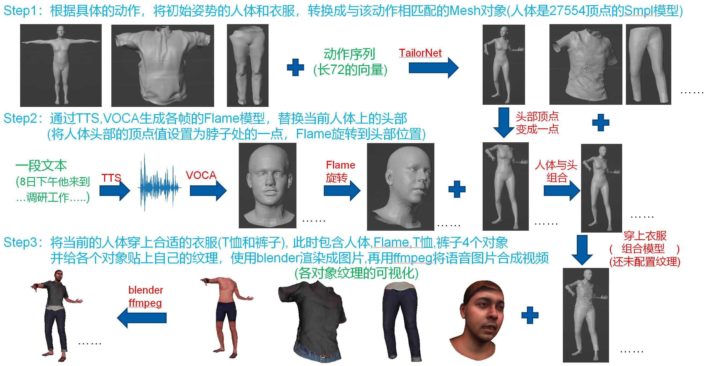
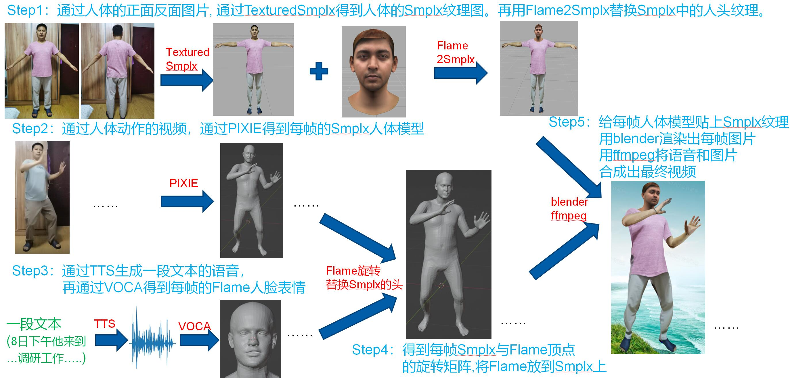

# VirtualDigitalHuman_WorkReport(正在完善中)
This is a work report repository about Virtual Digital Human, including 3D Human Head, 3D Human Bodies, 3D Human Motions, 3D Human Textures, and 3D Virtual Tryon. 

I have compiled our research results into the work report, the pdf can be found [here](VirtualDigitalHuman_WorkReport.pdf).

All materials provided by this repository, including MP4, GIF, PDF, JPG, have also been put on [pan.baidu.com](https://pan.baidu.com/s/1DAcX4ngI5wYj3Ad_goTp4w?pwd=7y69)

## 3DVirtualTryon

<table><tr>
<td></td>
<td></td>
</tr></table>

## 3DHumanReconstruction

<table><tr>
<td></td>
</tr></table>

